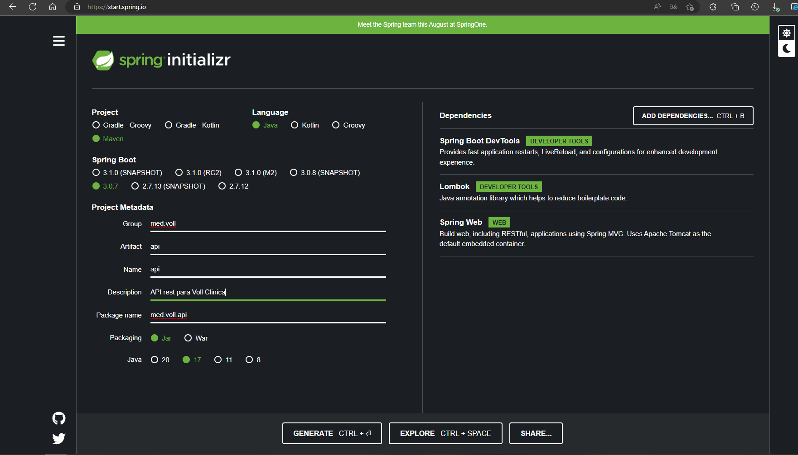
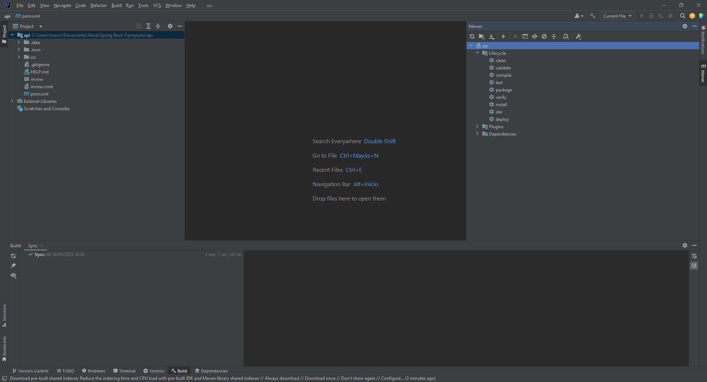
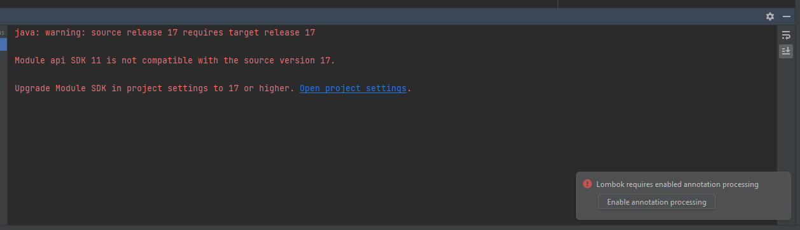
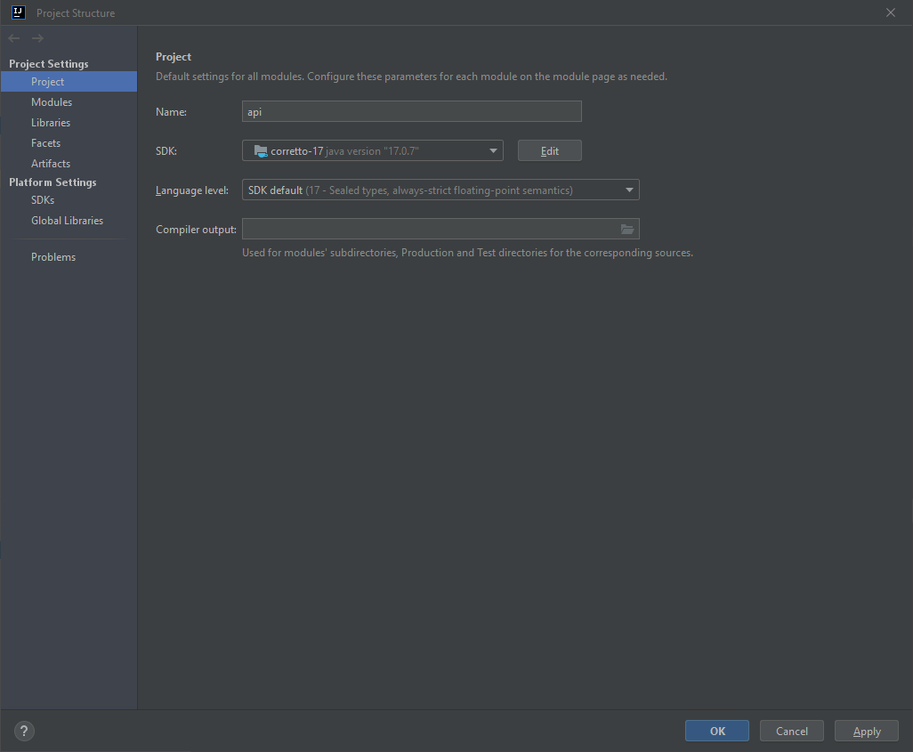
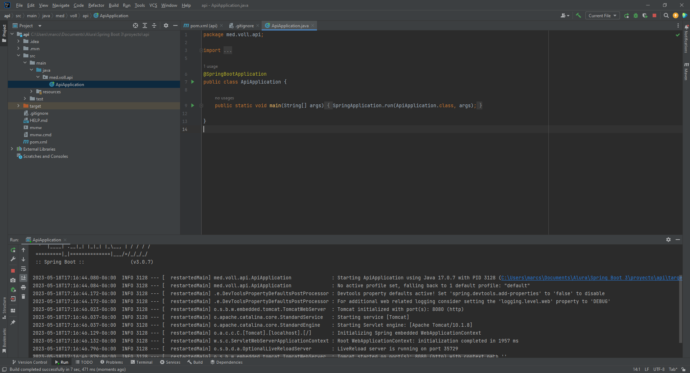
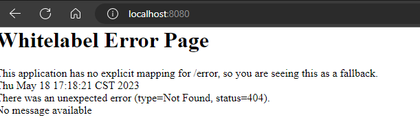
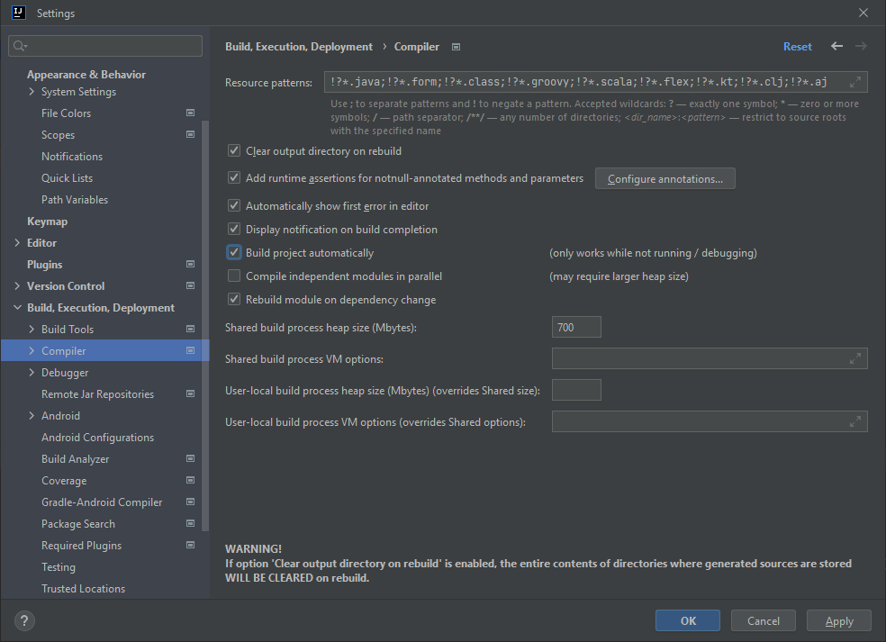
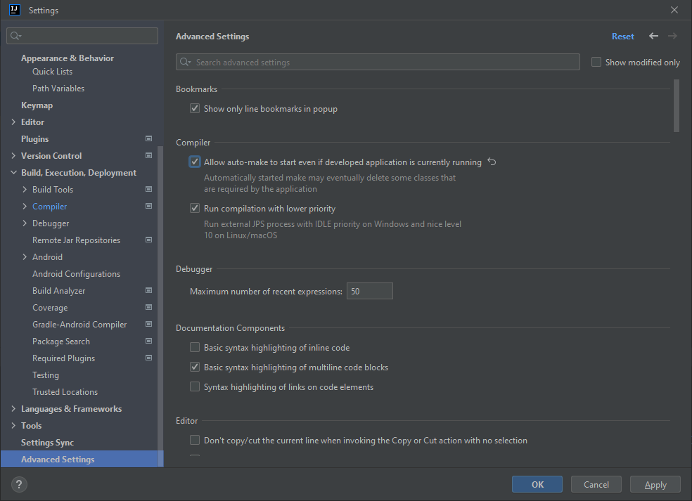

# Proyecto con java

## Objetivos
- Creacion de un API Rest
- CRUD (Create, Read, Delete)
- Validaciones
- Paginación y orden (Mostrarlos en grupos los datos)

## Tecnologias
- Spring Boot 3
- Java 17 
- Loombok: Abreviar codigo
- Mysql / Flyway (Gestor de base de datos a nivel de estructura)
- JPA (Persistencia)/ Hibernate (Implementación)
- Validation (Bean Validation)
- Maven: Gestor de dependencias
- Insominia 

## Proyecto
Se realizara una un CRUD de una clinica medica.

## Creando proyecto
Lo primero es entrar a [spring initializr](https://start.spring.io/) configurar el proyecto
- Manejador de paquetes: Maven
- Lenguaje: java
- Spring boot: 3.07
- Group: med.voll
- Artifact: api
- Name: api
- Description: API rest para Voll Clinica
- Package name: med.voll.api
- Packing: Jar
- Java: 17

Agregar las siguientes dependencias:
- Spring Boot DevTools
- Lombok
- Spring Web



- Clic en "Generate" para poder descargar el archivo.
- Descomprimir el archivo.
- Abriremos el proyecto con IntelliJ IDEA Community Edition 2022.3.2
- Tardara un tiempo en descargar las dependencias (MAVEN)



Al ejecutar necesitamos darle el permiso a Lombok para ejecutar las anotaciones en java


Además debemos corregir la versión de java, cambiar a java 17, clic en las letras azules "Open project settings"

En la ventana seleccionar en SDK: Correto-17, al finalizar dar clic en "OK"


Al volver a ejecutar el proyecto se iniciara y mostrará lo siguiente.


Al visitar la dirección http://localhost:8080/ Se mostrará lo siguiente


Es un mensaje de error de spring boot, pero es porque el proyecto esta en blanco

## Configurar los devTools
Ir a "File" elegir "Settings"
Al deplegarse la ventana buscar "Build, Execution, Deployment"
Buscar "Compiler"
Dejar activado "Build Project automatically"



Ahora ir "Advance Settings"
Dejar activado "Allow auto-make to start even if development application is currently running"
clic en "Ok"



Asi queda lista, asi se auto ejecutara o reiniciara el servidor al guardar cambios. Esto puede tardar algunos segundos.

## Instalar Insomnia
Es equivalente a Postman
- Descargar [Insomnia](https://insomnia.rest/) la versión gratuita

La interfaz del programa se ve de la siguiente manera:


## Agregar nuevas dependencias
Para esto necesitamos regresar a [spring initializr](https://start.spring.io/) y agregar las nuevas dependencias las cuales serán:
- Spring Data JPA
- MySQL Driver
- Flyway Migration


Dar clic en "EXPLORE"
Ir a "pom.xml" ahi elegir las dependencias que acabamos de agregar


Copiar y pegar esos datos al "pom.xml" de nuestro proyecto, se veran de color rojo las nuevas dependencias, porque no han sido descargados.


Para forzar la descarga de las nuevas dependecias es necesario dar clic en "Maven" y dar clic en "Refresh", tardara unos minutos para descargar las dependicias y quedara listo.


Si existen errores seran relacionados a las nuevas dependencias que se agregarón, en este caso será con MySQL necesita un source (fuente).

Debemos buscar "resources" y luego buscar "application.properties" y agregar lo siguientes comandos. (application.properties utiliza un formato clave=valor)
1. Especificaremos la url del servidor y al final el nombre de la base de datos
2. Nombre de usuario de la base de datos (Varia entre computadoras)
3. La contraseña de conexión (Varia entre computadoras).


Código 
```
spring.datasource.url=jdbc:mysql://localhost/vollmed_api
spring.datasource.username=root
spring.datasource.password=201122934
```
Volver a reiniciar el servidor y debe ejecutarse correctamente.

Si se muestra el error de base de datos no encontrado


Para corregirlo debemos crear la base de datos en nuestro motor de base de datos MySQL

Código 
```
CREATE DATABASE vollmed_api;
```
Y listo el servidor se debe iniciar sin problemas.

## Configurando flywaydb
Se encargara de la creación de la base de datos

- Crearemos una carpeta llamada "migration" en la carpeta "resource", flyway la detectara automaticamente


- Crearemos una carpeta llamada "db" en la carpeta "resource"


- Luego arrastraremos la carpeta "migration" dentro de "db"


- Dentro de la carpeta "migration" crearemos un arquivo .sql, para nombrar un archivo debe usarse la siguiente nomenclatura 
```
V1__Nombre-explicativo.sql
```
nosotros usaremos la siguiente
```
V1__create-table-medicos.sql
```


el codigo SQL es el siguiente:
```
CREATE TABLE medicos(
    id bigint NOT NULL auto_increment,
    nombre VARCHAR(100) NOT NULL,
    email VARCHAR(100)  NOT NULL UNIQUE,
    documento VARCHAR(6) NOT NULL UNIQUE,
    especialidad VARCHAR(100)  NOT NULL,
    calle VARCHAR(100)  NOT NULL,
    distrito VARCHAR(100)  NOT NULL,
    complemento VARCHAR(100),
    numero VARCHAR(20),
    ciudad VARCHAR(100) NOT NULL,
    PRIMARY KEY(id)
);
```
Agregaremos el código 


La consola mostrara que la migración se realizo correctamente


Si vamos a MySQL se mostrara la tabla creada


Si se genera un error como el siguiene

```
Exception encountered during context initialization - cancelling refresh attempt: org.springframework.beans.factory.BeanCreationException: Error creating bean with name 'flywayInitializer' defined in class path resource [org/springframework/boot/autoconfigure/flyway/FlywayAutoConfiguration$FlywayConfiguration.class]: Validate failed: Migrations have failed validation
```
Observe en el mensaje de error que se indica que alguna migración falló, lo que impide que el proyecto se inicie correctamente. Este error también puede ocurrir si el código de migración no es válido y contiene algún fragmento de SQL escrito incorrectamente.

Para solucionar este problema será necesario acceder a la base de datos de la aplicación y ejecutar el siguiente comando sql:

```
delete from flyway_schema_history where success = 0;
```

## Paginación

El comando anterior se usa para eliminar de la tabla Flyway todas las migraciones cuya ejecución falló. Después de eso, simplemente corrija el código de migración y ejecute el proyecto nuevamente.

por defecto, los parámetros utilizados para realizar la paginación y el ordenamiento deben llamarse page, size y order. Sin embargo, Spring Boot permite modificar los nombres de dichos parámetros a través de la configuración en el archivo application.properties.

Por ejemplo, podríamos traducir al español los nombres de estos parámetros con las siguientes propiedades:

```
spring.data.web.pageable.page-parameter=pagina
spring.data.web.pageable.size-parameter=tamano
spring.data.web.sort.sort-parameter=orden
```

Por lo tanto, en solicitudes que usen paginación, debemos usar estos nombres que fueron definidos. Por ejemplo, para listar los médicos de nuestra API trayendo solo 5 registros de la página 2, ordenados por email y en orden descendente, la URL de solicitud debe ser:
```
http://localhost:8080/medicos?tamano=5&pagina=1&orden=email,desc
```
